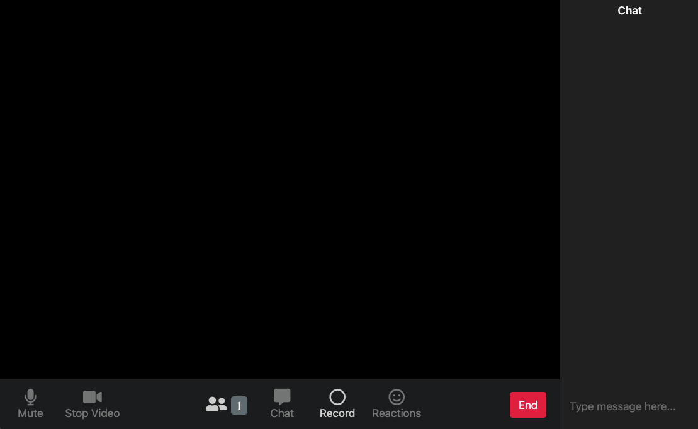

# Projeto base da JS Expert Week 2.0

Nesta semana pudermos desenvolver uma aplicação web com o clone de algumas funcionalidades do aplicativo de videoconferência ZOOM. Dentre essas funcionalidades, desenvolvemos videoconferência em grupos utilizando webRTC (para facilitar o compartilhamento de áudio e vídeo), Peer-to-Peer (para compartilhar serviços e dados sem a necessidade de um servidor central) e websocket (para sincronizar os eventos gerados durante as chamadas), arquivamento de áudio e vídeo transmitido pelos usuários durante as chamadas usando as api's do Browser MediaRecorder e getUserMedia e por fim o download dos arquivos gerados.

Também pudermos aprender na prática alguns Design Patterns para organização, melhora na qualidade e redução da complexidade do código. Dentre eles, o Builder, Dependency Injection e Event Delegation. Além de princípios de encapsulamento, responsabilidade única entre outros.

- Acesse o [home](./aula04/public/pages/home/index.html) para acessar a home page
- Acesse o [room](./aula04/public/pages/room/index.html) uma room específica

## Home Page

## Room

### Créditos

- Layout da home foi baseada no codepen do [Nelson Adonis Hernandez
](https://codepen.io/nelsonher019/pen/eYZBqOm)
- Layout da room foi adaptado a partir do repo do canal [CleverProgrammers](https://github.com/CleverProgrammers/nodejs-zoom-clone/blob/master/views/room.ejs)